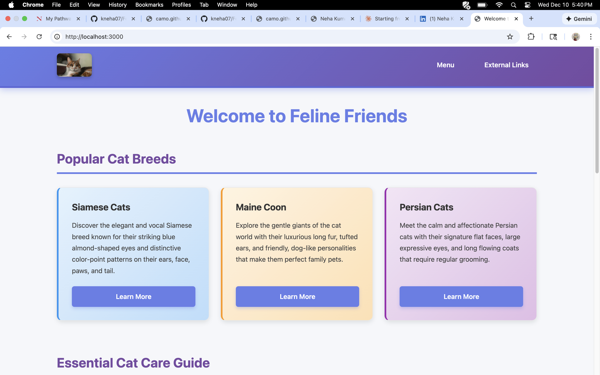
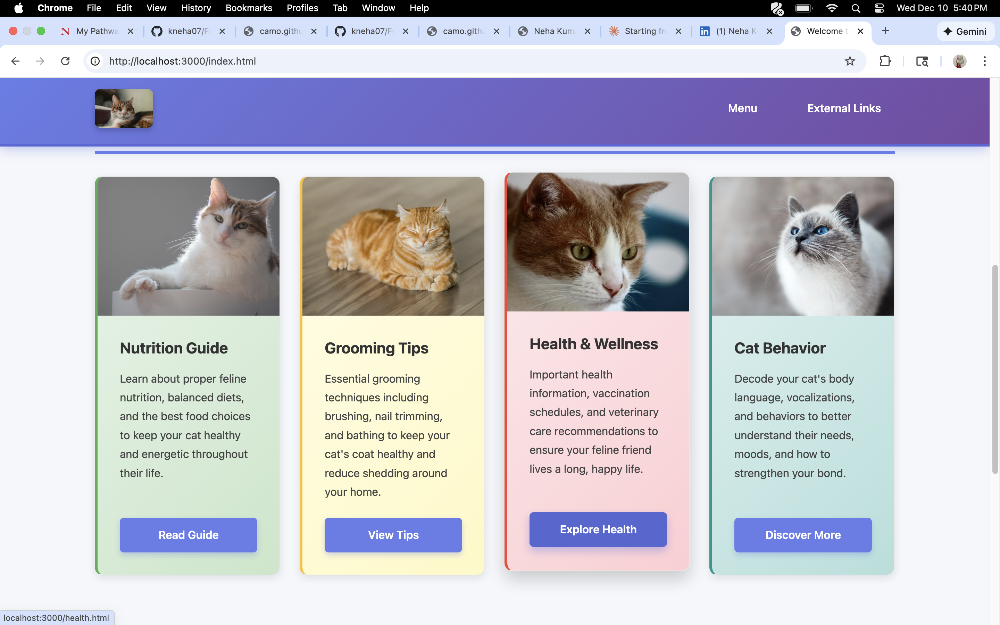
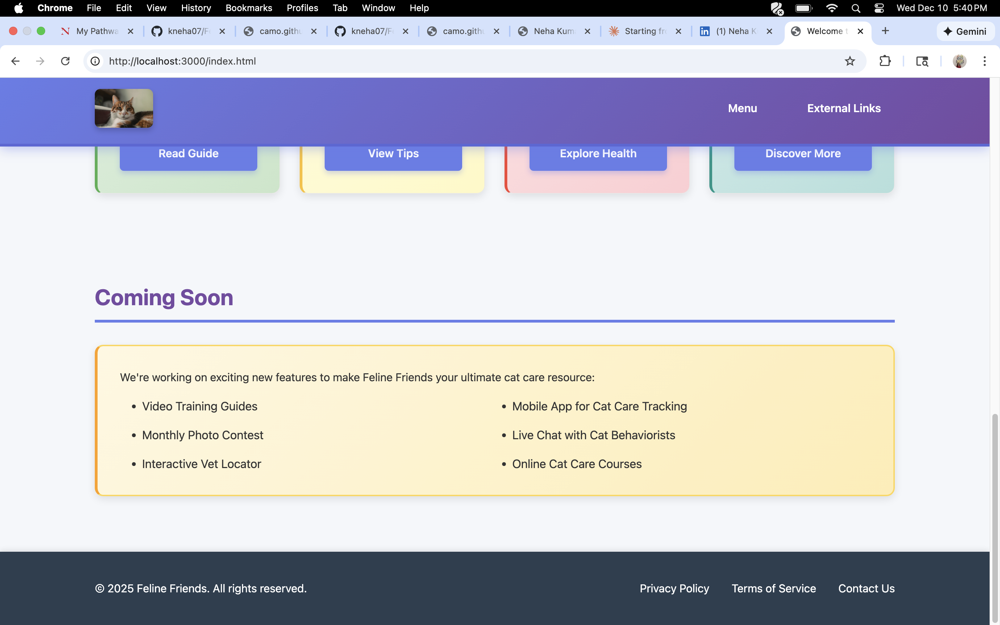
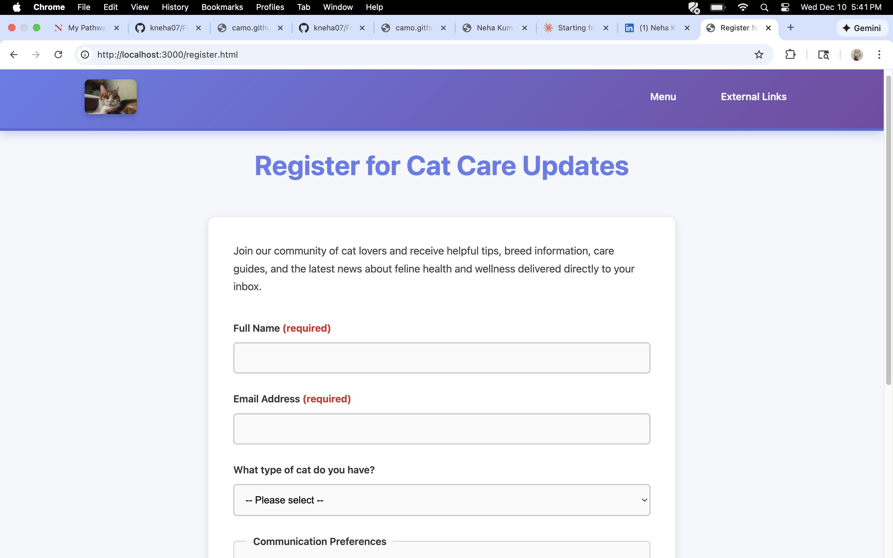
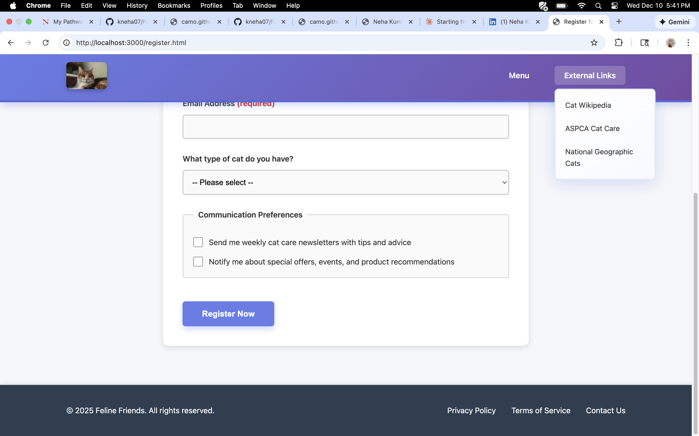

# Feline Friends 🐱

A responsive cat care website built with HTML, CSS, and Node.js/Express, providing comprehensive information about cat breeds, care guides, and registration functionality.

## 📋 Project Overview

Feline Friends is a static website designed to educate cat owners and enthusiasts about various cat breeds, essential care practices, and feline wellness. The site features a clean, modern design with accessible navigation and mobile-responsive layouts.

## ✨ Features

- **Responsive Design**: Fully responsive layout that adapts seamlessly to desktop, tablet, and mobile devices
- **Accessible Navigation**: Keyboard-navigable dropdown menus with ARIA attributes for screen readers
- **Cat Breed Showcase**: Information cards highlighting popular cat breeds (Siamese, Maine Coon, Persian)
- **Care Guides Section**: Dedicated cards for nutrition, grooming, health, and behavior topics
- **Registration Form**: Fully functional form with validation for newsletter sign-ups
- **Modern UI/UX**: 
  - Gradient color schemes
  - Smooth hover animations and transitions
  - Card-based layout with visual hierarchy
  - Sticky header navigation
  - Focus indicators for accessibility

## 🛠️ Technologies Used

- **Frontend**: HTML5, CSS3 (Flexbox & CSS Grid)
- **Backend**: Node.js, Express.js
- **Form Handling**: Express urlencoded middleware
- **Design Principles**: Mobile-first responsive design, WCAG accessibility guidelines

## 📁 Project Structure

```
feline-friends/
├── public/
│   ├── css/
│   │   └── styles.css
│   ├── images/
│   │   ├── cat-logo.png
│   │   ├── nutrition.jpg
│   │   ├── grooming.jpg
│   │   ├── health.jpg
│   │   └── behavior.jpg
│   ├── index.html
│   ├── about.html
│   └── register.html
├── server.js
├── package.json
├── licenses.txt
└── README.md
```

## 🚀 Getting Started

### Prerequisites

- Node.js (v14 or higher)
- npm (Node Package Manager)

### Installation

1. Clone the repository:
```bash
git clone https://github.com/kneha07/Feline-Friends-.git
cd Feline-Friends-
```

2. Install dependencies:
```bash
npm install
```

3. Start the server:
```bash
node server.js
```

4. Open your browser and navigate to:
```
http://localhost:3000
```

## 💻 Usage

### Navigation
- **Home**: Browse cat breeds and care guides
- **About**: Learn about Feline Friends' mission and cat care philosophy
- **Register**: Sign up for newsletters and updates

### Form Submission
The registration form captures:
- Full name (required)
- Email address (required)
- Cat breed selection
- Communication preferences (newsletters, promotions)

Form data is processed via POST request and displayed on a results page.

## 🎨 Key Design Features

### CSS Grid Layout
- 12-column grid system for flexible content arrangement
- Responsive breakpoints at 600px and 800px
- Mobile-first approach with progressive enhancement

### Accessibility
- Semantic HTML5 elements
- ARIA labels and roles
- Keyboard navigation support
- Focus indicators on all interactive elements
- High contrast color schemes

### Visual Design
- Purple gradient header (#667eea to #764ba2)
- Color-coded content cards by category
- Smooth transitions and hover effects
- Box shadows for depth and hierarchy

## 📱 Responsive Breakpoints

- **Desktop**: > 800px (default)
- **Tablet**: 600px - 800px
- **Mobile**: < 600px

## 📸 Screenshots

### Homepage - Popular Cat Breeds


### Essential Cat Care Guide


### Coming Soon Features


### Registration Form


### External Links Menu


## 🔮 Future Enhancements

- Video training guides
- Mobile app for cat care tracking
- Monthly photo contest
- Live chat with cat behaviorists
- Interactive vet locator
- Online cat care courses

## 📝 License

This project uses images from Unsplash under the [Unsplash License](https://unsplash.com/license).

See `licenses.txt` for detailed image attribution.

## 👤 Author

**Neha**
- GitHub: [@kneha07](https://github.com/kneha07)
- LinkedIn: [Neha K](https://www.linkedin.com/in/kneha101n/)

## 🙏 Acknowledgments

- Cat images provided by [Unsplash](https://unsplash.com)
- Font stack uses system fonts for optimal performance
- Inspired by modern web design principles and accessibility best practices

---

⭐ Star this repository if you find it helpful!